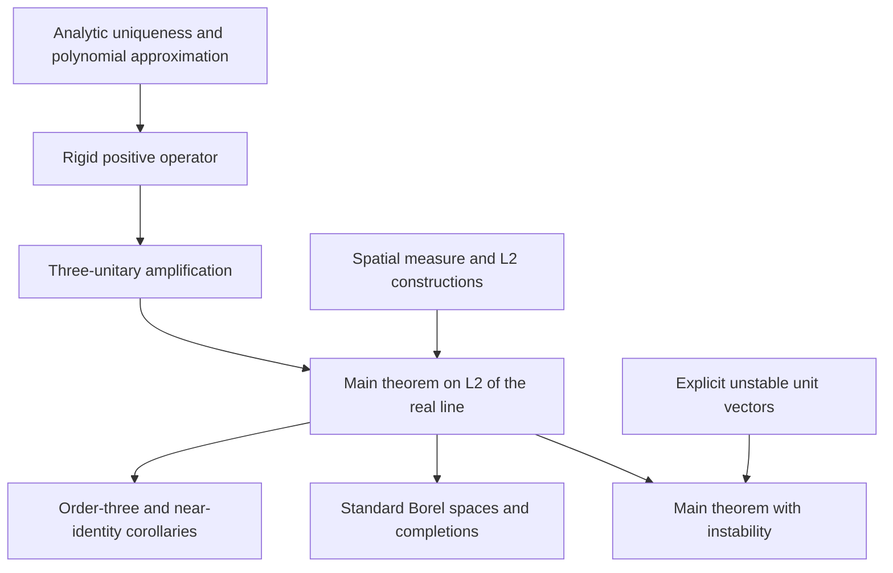

# Paper-to-code map

All declarations below are in the `OperatorPhaseRetrieval` namespace. This map refers to the supplied September 17, 2026 manuscript by Lukas Liehr, Daniel Omer, and Mitchell A. Taylor.

## Main statements

| Paper result | Lean statement | Module |
|---|---|---|
| Theorem 2.1: one projection for every three distinct phases | `main : MainStatement` | [Main](../OperatorPhaseRetrieval/Main.lean) |
| Corollary 2.2: `I, U, U²` with `U³ = I` | `exists_order_three_phase_retrieval` | [Main](../OperatorPhaseRetrieval/Main.lean) |
| Corollary 2.2: `U` and `U²` arbitrarily close to the identity | `exists_near_identity_phase_retrieval` | [Main](../OperatorPhaseRetrieval/Main.lean) |
| Lemma 3.1: positive-area modulus uniqueness on a connected open domain | `holomorphic_phase_of_ae_norm_eq` | [AnalyticUniqueness](../OperatorPhaseRetrieval/AnalyticUniqueness.lean) |
| Lemma 3.2: three-phase polarization | `three_phase` | [ThreePhase](../OperatorPhaseRetrieval/ThreePhase.lean) |
| Proposition 4.1: small positive compact injective operator, unique entire extensions, and modulus rigidity | `exists_entire_rigid_model` | [EntireModel](../OperatorPhaseRetrieval/EntireModel.lean) |
| Proposition 5.1: amplification to a family of unitary measurements | `amplification` | [Complement](../OperatorPhaseRetrieval/Complement.lean) |
| Lemma 6.1: modulus-preserving spatial unitary | `exists_spatial_unitary` | [SpatialExistence](../OperatorPhaseRetrieval/SpatialExistence.lean) |
| Lemma 6.1: completed spaces | `exists_spatial_unitary_completions` | [Completion](../OperatorPhaseRetrieval/Completion.lean) |
| Corollary 6.2: general nonzero atomless standard Borel spaces | `phase_retrieval_on_standardBorel` | [Main](../OperatorPhaseRetrieval/Main.lean) |
| Corollary 6.2: completions | `phase_retrieval_on_completion` | [Completion](../OperatorPhaseRetrieval/Completion.lean) |
| Order-three and near-identity corollaries on general spaces and completions | `order_three_on_standardBorel`, `near_identity_on_standardBorel`, `order_three_on_completion`, `near_identity_on_completion` | [Consequences](../OperatorPhaseRetrieval/Consequences.lean) |
| Theorem 2.1 and Remark 6.3 for the same projection | `main_with_instability` | [TransferredInstability](../OperatorPhaseRetrieval/TransferredInstability.lean) |

## Mathematical meaning

- `RealL2` is Mathlib's `Lp ℂ 2` for Lebesgue measure on ℝ.
- `ModEq f g` means pointwise equality of norms almost everywhere.
- `PhaseRelated f g` means `g = ω • f` for one complex scalar `ω` of norm one.
- `ProjectionWorks` quantifies the projection before the three phases. It is defined in [SpatialTransfer](../OperatorPhaseRetrieval/SpatialTransfer.lean).
- `L2UniformPhaseRecovery` states uniform recovery modulo phase on the unit sphere. The data criterion uses componentwise distance bounds, equivalent to the usual norm on a fixed finite product.

## Organization of the 34 proof modules

| Part | Modules |
|---|---|
| Algebra and amplification | `ThreePhase`, `L2`, `Amplification`, `Projection`, `BlockRotation`, `AmplificationTheorem`, `Complement` |
| Analytic smoothing | `DiagonalSmoothing`, `AnalyticUniqueness`, `PolynomialSmoothing`, `PolynomialBasis`, `EntireModel` |
| Concrete polynomial-dense model | `CompactModel`, `UniformAlgebra`, `GapApproximation`, `ProductApproximation`, `RigidModel` |
| Spatial and measure-theoretic constructions | `SpatialTransfer`, `SpatialPullback`, `AESpatialPullback`, `AtomlessCDF`, `ProbabilitySpatial`, `WeightedL2`, `SpatialExistence`, `DoubleL2`, `StandardBorelDouble`, `Completion` |
| Final results and instability | `Corollaries`, `NearIdentity`, `Instability`, `Main`, `MagnitudeDistance`, `TransferredInstability`, `Consequences` |

The extra `MathlibImports` module contains only shared Mathlib imports. The library root imports every proof module; the standalone generator checks that none is omitted.

The following diagram shows the main proof stages, rather than every file-level import:

## Construction choices and scope

The compact model is a positive-area product of compact subsets of `(0, 1)` avoiding rational coordinates. Polynomial density is proved for this model through a closed uniform algebra, coordinate cuts, and Stone–Weierstrass. The formalization does not claim to prove the full Mergelyan theorem.

The smoothing weights use an explicit polynomial bound and a factor of `1/16`. This is an alternative to the manuscript's exact displayed weights; it satisfies the required positivity, summability, analytic convergence, and `‖C‖ ≤ 1/8` conclusions. This choice was already present in the supplied formalization.

The split into modules preserves all 332 named theorem/definition/abbreviation declarations, including 272 theorems. The theorem bodies were carried over from the corrected standalone file without mathematical edits. The new imports and local scope declarations make each source file independently elaboratable with its dependencies.
